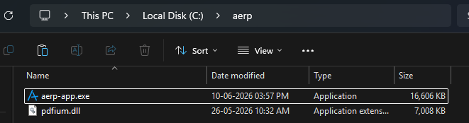
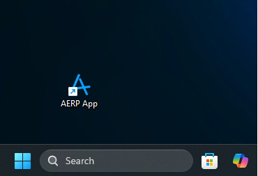
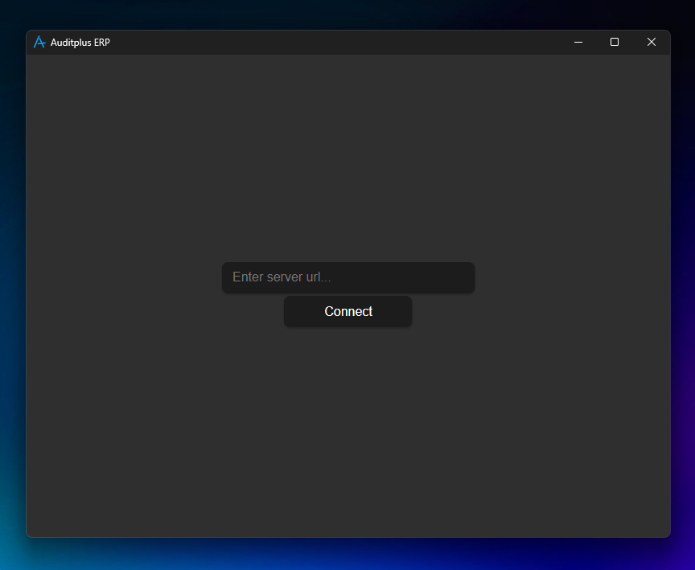
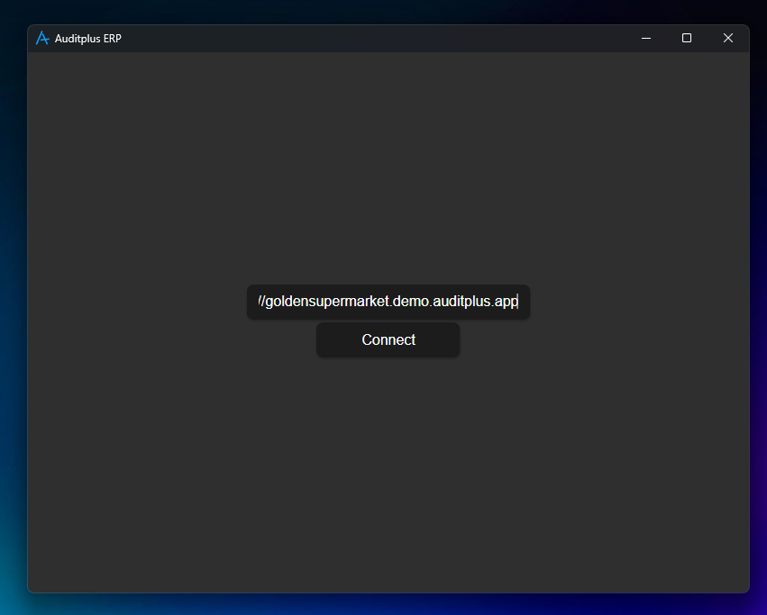
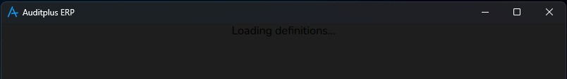
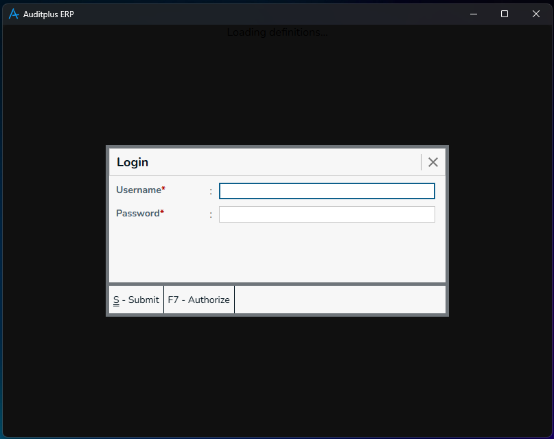
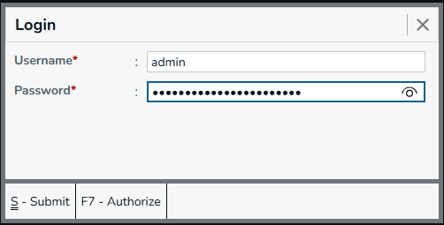
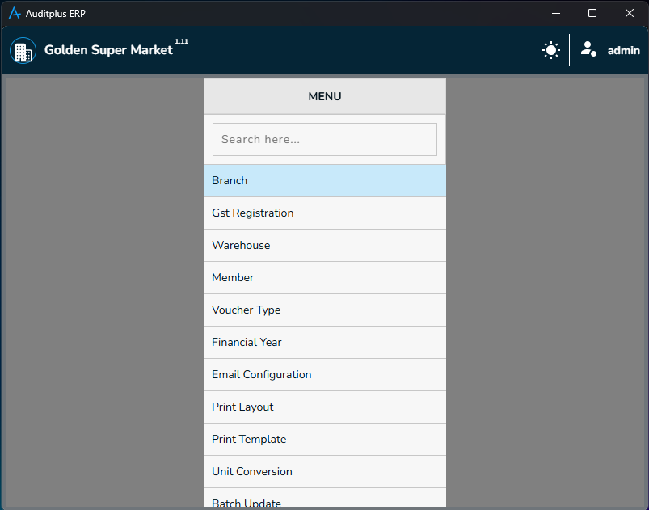

# Auditplus ERP Application 

Auditplus is a Complete ERP Solution, Auditplus ERP (Enterprise Resource Planning) is a centralized software system 
that integrates core business processes — like finance, HR, supply chain, manufacturing, sales, 
and customer service into a unified platform.

Its purpose is to streamline operations, improve data accuracy, and enable real-time decision-making 
by providing a single source of truth across departments.

:::note
TODO: Cloud Registration / Licensing
:::

## Getting Started

Get started by registering a new account in **[Auditplus Cloud](https://cloud.auditplus.io)** and create a new license **( Free / Paid )**

There are some ways to setup Auditplus ERP Application,

1. [Cloud Setup](#cloud-setup)
2. [Self Hosted](#self-hosted--local-setup)
3. [Local / On-Premise Setup](#local--on-premise-setup)

## Cloud Setup

- Auditplus Team will setup the server on behalf of you in cloud and give the link & credentials to connect your server.

You can download the client application using the link **[AERP](https://www.auditplus.io/download/aerp-app.zip)**.

- There is no installation steps, just download and follow the below steps.
- Extract the zip file in any folder in your computer.
- Create shortcut in desktop.
- Open application by double clicking aerp-app.exe in folder where you placed.

- Open application by double clicking the 'aerp application' shortcut in your desktop

- Now, you can see the AERP application on your screen.

- Enter the url to your server. (Sample demo url)
  - Ex: https://goldensupermarket.demo.auditplus.app
  

- Click 'Connect' button or press 'Enter' key while cursor on textbox.

- Now, The app loads application bundle from cloud, sometimes, on first load / refresh, it takes sometime.

- This is login screen, please enter your credentials, which you received from Auditplus Technologies.

- Now, you will landup on Menu Screen / Dashboard - based on your setup.

* On the Top Left - Organization name `Golden Super Market` & the version number of frontend application.
* On the Top Right - Theme change button, followed by logged-in username.
* Change theme by clicking on theme change button. 

## Self Hosted Setup

:::note
TODO: Self Hosted Setup
:::

## Local / On-Premise Setup

:::note
TODO: Local / On-Premise Setup
:::