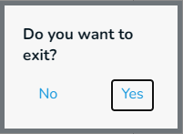
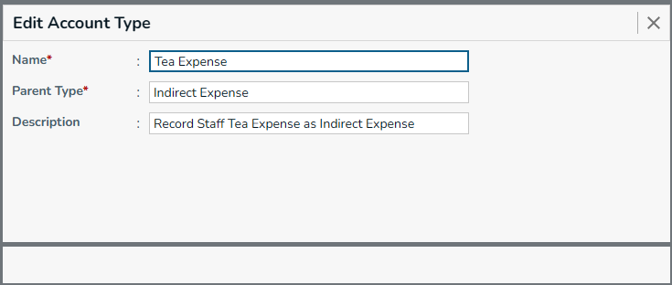
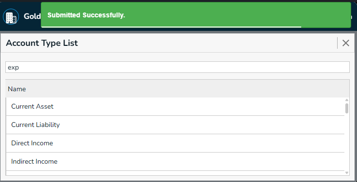
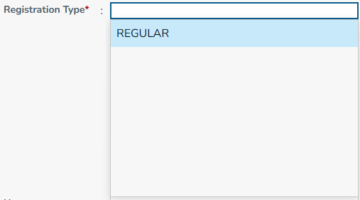
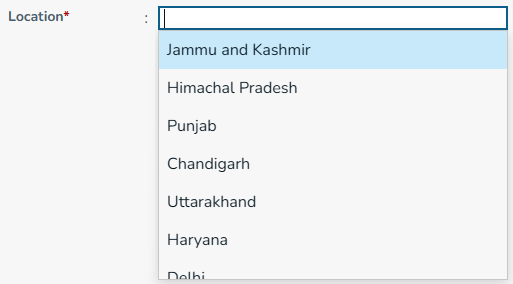
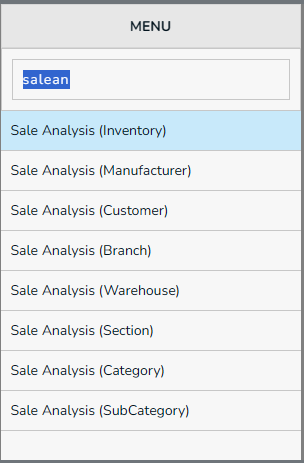
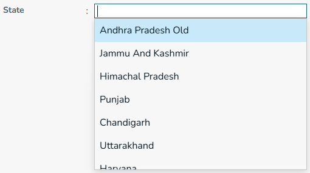
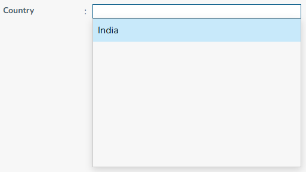

## Shortcut Keys in Auditplus ERP

|Shortcut key | Action |
|-|-|
|Esc            | Go back               |
|Arrow Down/Up  | Move cursor up / down |
|Ctrl + S| Save the current form|
|Ctrl + R| Reset the current form|
|Ctrl + L| Goto list page|

## On Esc

While press `Esc`, you will prompted with a confirmation box,  
you can select `Yes/No` by click / press `Arrow Up/Down` & `Enter`.

## Close button

Click on close button `X` will close the form.

## Buttons on Hidden 

* Sometime, if buttons hide due to switching between screens, Don't panic,  
Simply press `Alt` or `Shift` or `Ctrl` or `Tab` or any combination, it will restore buttons.

## Saved Success Toast

* After saving `Ctrl+S` & editing or completing any actions, Toast message will appear like below

## Notes

There are some dropdowns are available in forms,
while you press `spacebar` from within that search-box, an Autocomplete will showed down.
you can select one from listed.  

you can enter text as all small letters and without spaces. the search box will works smothly.

Registration Type Search box

Location Search box

Menu Search box

### State Search box

### Country Search box

