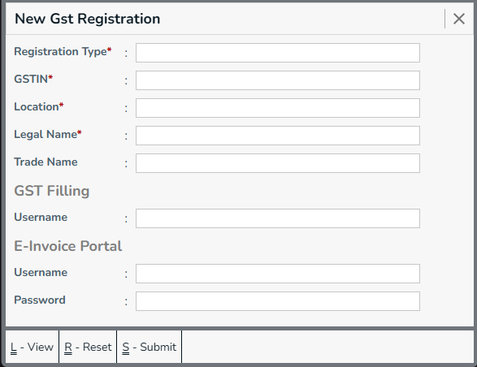
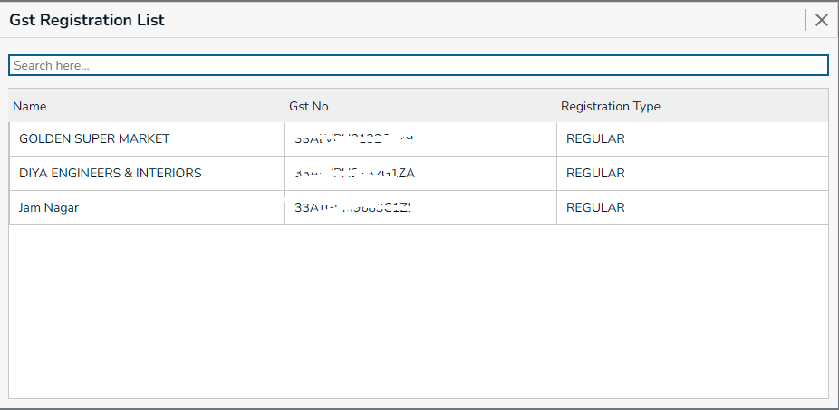
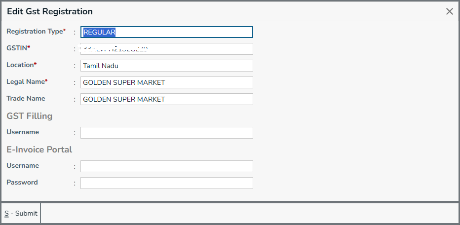

GST registration is required to legally collect tax from customers, claim input tax credit on purchases, 
and comply with Indian tax laws.
This detail is required for many form, like branch, accounts, sales, etc.

## New Gst Registration

Menu -> `Gst Registraion`

**Primary Details**
  * Select **Gst registration type**, Now, we support only `REGULAR`.
  * Enter your company **GSTIN** number, this should be valid GST Number.
  * Select the **Location** of your complany, Based on the first 2 digits of gst number. Ex: 33-Tamilnadu, it will be auto selected.
  * Enter the **Legal Name**, This is the party name who owns this gst number.

:::note
For demo purpose:
**[Get Demo GST Number](https://stackblitz.com/edit/typescript-svsrga?file=index.ts)** 
:::  

**Other Details (Optional)**
  * Enter the **Trade Name**, This is the shop name or company name, how peoples know the party or company.

**Gst Filling (Optional)**
  * Enter the **Username**, It is given by gst portal to file GSTR1.

**E-Invoice Portal (Optional)** - It will be generated from e-invoice portal.
  * Enter **Username**, used to login e-invoice portal.
  * Enter **Password**, used to login e-invoice portal.

:::note
You can get EInvoice Portal credentials, by registering from **[E-Invoice Portal](https://einvoice1.gst.gov.in)**
:::

**Actions**
* **Submit** - Press `Ctrl+S` or Click on `Submit` button, this form will be submitted to server and new `Gst Registration` will be saved in server. and a green color `success` toast will be showed.
* **Reset** - Press `Ctrl+R` or Click on `Reset` button, the filled form will be resetted, and you can enter new details.
* **View** - Press `Ctrl+L` or Click on `View` button, you will be navigated to `Gst Registraion List` page.
* **Go To Back** - Press `Esc` or Click on `X` (Forms top right corner), you will be navigated to the previous page. and the `Menu` page will be showed.

## Gst Registration List

All available `Gst Registraion's` are listed here. These registrations are created by admin, or allowed members, you can filter the listed details using the `search here` box.

**Actions**
* Use mouse, you can click on row you want to edit, then it will be redirected to `Edit Gst Registraion` Form, There you can change details.
* You can move cursor arround this page using `Arrow Down/Arrow Up`, Press `Enter` key while row is highlighted. then it will be redirected to `Edit Gst Registraion` Form.
* Search any gst registration using **Search here** box.

## Edit Gst Registration

Change the details which are entered, or add details that are unfilled.

**Actions**
* **Submit / Ctrl+S** to save the form with edited details.
* **Esc** / **X** to go back, it will be ask a confirmation dialog, select `Yes` to submit the changes or `No` to discard the changes.
