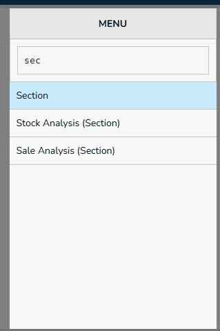
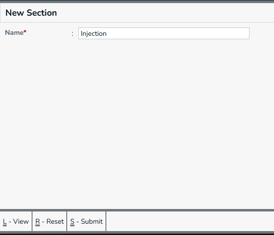
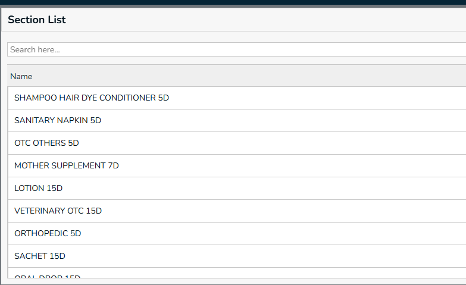

Section means a group/category under which related products are organized

## New Section

type `sec` in menu box, it lists menus that are starts with `sec`. press down arrow and select `Section`.

## Create Section

 Required Fields,
  * Name - Section Name
  
  **Actions**
* **Submit** - Press `Ctrl+S` or Click on `Submit` button, this form will be submitted to server and new `Section` will be saved in server. and a green color `success` toast will be showed.
* **Reset** - Press `Ctrl+R` or Click on `Reset` button, the filled form will be resetted, and you can enter new details.
* **View** - Press `Ctrl+L` or Click on `View` button, you will be navigated to `Section` page.

## Section List

* To list the Section use Ctlr+L

