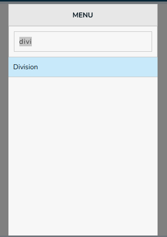
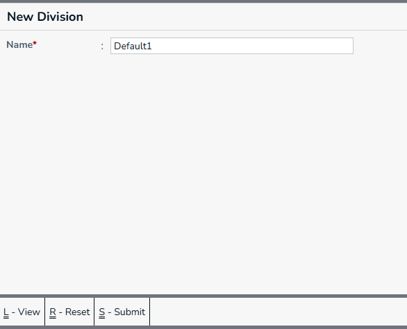
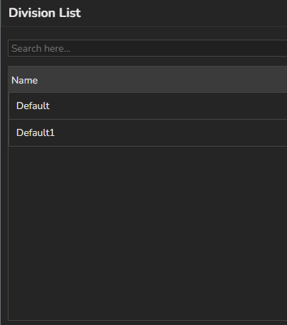

A division can be used to separate business operations, branches, departments, or other organizational units.

## New Division

## Create Division

 Required Fields,
  * Name - Division Name
  
  **Actions**
* **Submit** - Press `Ctrl+S` or Click on `Submit` button, this form will be submitted to server and new `Division` will be saved in server. and a green color `success` toast will be showed.
* **Reset** - Press `Ctrl+R` or Click on `Reset` button, the filled form will be resetted, and you can enter new details.
* **View** - Press `Ctrl+L` or Click on `View` button, you will be navigated to `Division` page.

## Division List

* To list the division use Ctlr+L

