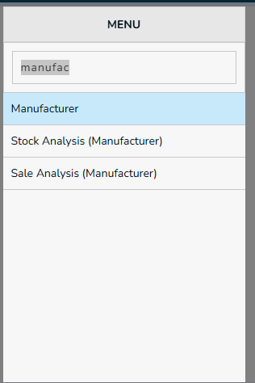
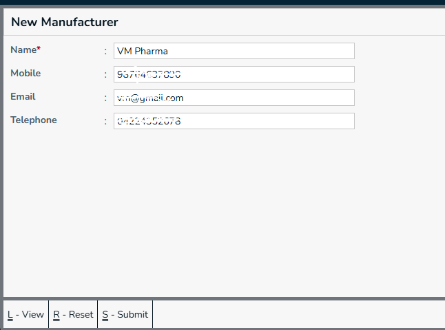
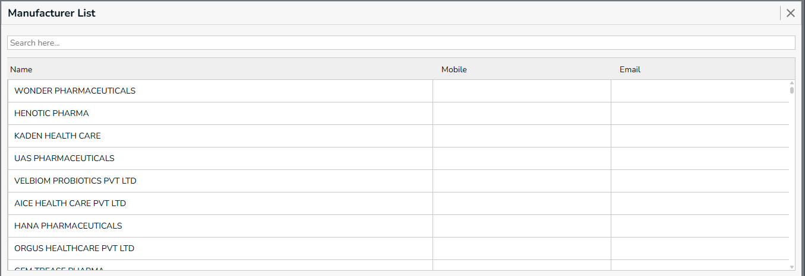

In inventory management, a Manufacturer is the company or organization that produces or makes a product. It is usually stored as a separate field in inventory so that you can identify who made the item.

## New Manufacturer
type `manu` in menu box, it lists menus that are starts with `manu`. press down arrow and select `Manufacturer`.

## Create Manufacturer

 Required Fields,
  * Name - Manufacturer Name
  
  **Actions**
* **Submit** - Press `Ctrl+S` or Click on `Submit` button, this form will be submitted to server and new `Manufacturer` will be saved in server. and a green color `success` toast will be showed.
* **Reset** - Press `Ctrl+R` or Click on `Reset` button, the filled form will be resetted, and you can enter new details.
* **View** - Press `Ctrl+L` or Click on `View` button, you will be navigated to `Manufacturer` page.

## Manufacturer List

* To list the Manufacturer use Ctlr+L

