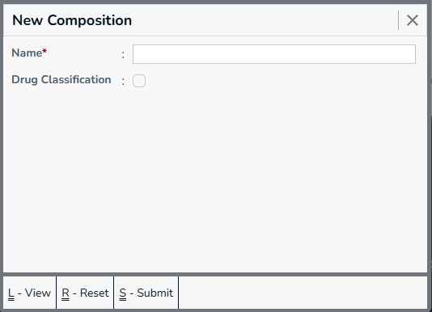
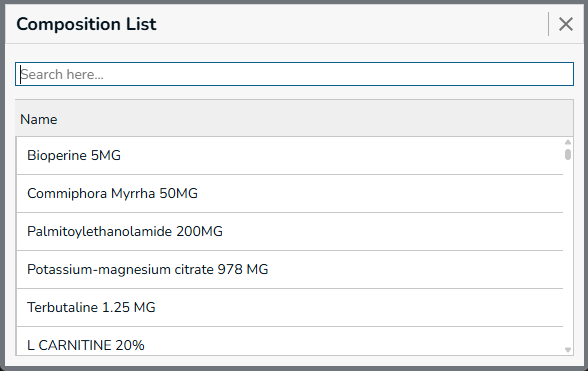
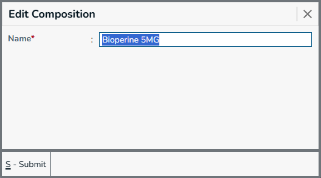

Composition is used to define the active ingredients or chemical substances present in a medicine or product. It helps identify the ingredients and their respective strengths, making it easier to recognize products that contain the same or similar active ingredients even when their brand names are different.

For example, different medicines may be sold under different brand names but contain the same main active ingredient. The Composition master allows these ingredients to be maintained separately and associated with the appropriate products.

## New Composition

Menu -> `Composition`

  

Required Fields
  * Name - Composition name

Optional Fields

  

The Drug Classification checked box only appears when an application uses the Medical extension.
* Drug Classification - [Drug Classification](../drug-classification/index.mdx)

## Composition List

All available `Composition's` are listed here. You can filter the listed details using the `search here` box.

 

Examples of compositions maintained in the system include:

 * Bioperine 5 MG
 * Commiphora Myrrha 50 MG
 * Palmitoylethanolamide 200 MG
 * Potassium-Magnesium Citrate 978 MG
 * Terbutaline 1.25 MG
 * L-Carnitine 20%

These compositions can later be associated with products to indicate the chemical or active ingredients contained in the product.

**Actions**
* **Submit** - Press `Ctrl+S` or Click on `Submit` button, this form will be submitted to server and new `Gst Registration` will be saved in server. and a green color `success` toast will be showed.
* **Reset** - Press `Ctrl+R` or Click on `Reset` button, the filled form will be resetted, and you can enter new details.
* **View** - Press `Ctrl+L` or Click on `View` button, you will be navigated to `Gst Registraion List` page.
* **Go To Back** - Press `Esc` or Click on `X` (Forms top right corner), you will be navigated to the previous page. and the `Menu` page will be showed.

## Edit Composition

Select the composition from the list to edit the composition.

 

