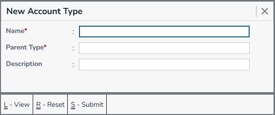
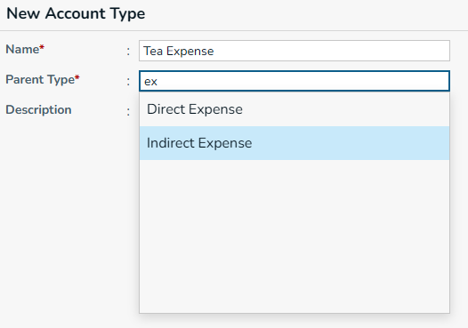
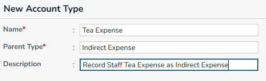
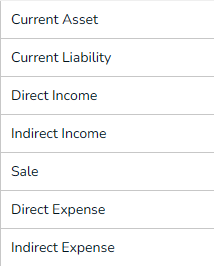
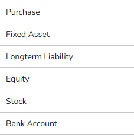
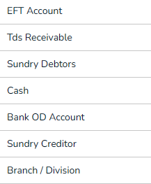
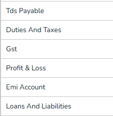
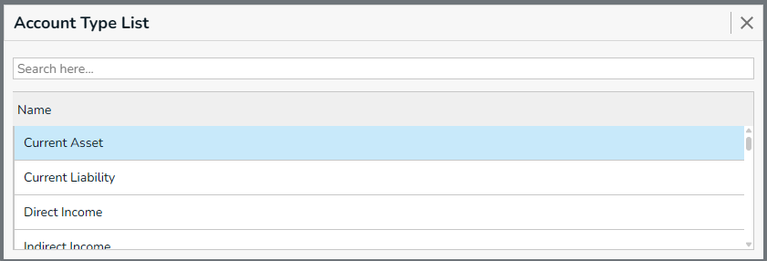
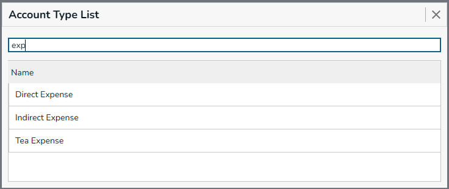
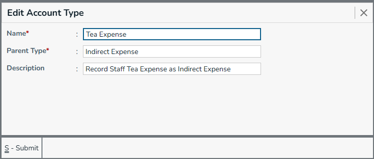

## New Account Type

Required Fields
  * Name - Account name
  * Parent Type - Parent Account type 

Optional Fields
  * Description

To Create new account type, you need to know some details about [Default Account Types Details](#default-account-types-details), 
 you can create new account type under account type which are having true in AllowSubType.

You can only create account type under Account Type which have 'Allow Sub Type' is `true`. See below for [details](#default-account-types-details).

## Default Account Types

|||||
|-|-|-|-|

## Default Account Types Details

| Account Type Name      | Default Name            | Base Types                                            | Allow Account | Allow Sub Type |Parent Type|
| :--------------------- | :---------------------- | :---------------------------------------------------- | :------------ | :------------- |:----------|
| Current Asset          | CURRENT\_ASSET          | CURRENT\_ASSET                                        | true          | true           ||
| Current Liability      | CURRENT\_LIABILITY      | CURRENT\_LIABILITY                                    | true          | true           ||
| Direct Income          | DIRECT\_INCOME          | DIRECT\_INCOME                                        | true          | true           ||
| Indirect Income        | INDIRECT\_INCOME        | INDIRECT\_INCOME                                      | true          | true           ||
| Sale                   | SALE                    | SALE                                                  | true          | false          ||
| Direct Expense         | DIRECT\_EXPENSE         | DIRECT\_EXPENSE                                       | true          | true           ||
| Indirect Expense       | INDIRECT\_EXPENSE       | INDIRECT\_EXPENSE                                     | true          | true           ||
| Purchase               | PURCHASE                | PURCHASE                                              | true          | false          ||
| Fixed Asset            | FIXED\_ASSET            | FIXED\_ASSET                                          | true          | true           ||
| Longterm Liability     | LONGTERM\_LIABILITY     | LONGTERM\_LIABILITY                                   | true          | true           ||
| Equity                 | EQUITY                  | EQUITY                                                | true          | true           ||
| Stock                  | STOCK                   | STOCK                                                 | false         | false          ||
| Profit & Loss          | PROFIT\_LOSS            | PROFIT\_LOSS                                          | false         | false          ||
| Loans and Liabilities  | LOANS\_AND\_LIABILITIES | LOANS\_AND\_LIABILITIES                               | true          | true           ||
| Bank Account           | BANK\_ACCOUNT           | CURRENT\_ASSET,  BANK\_ACCOUNT                    | true          | false          |Current Asset|
| EFT Account            | EFT\_ACCOUNT            | CURRENT\_ASSET,  EFT\_ACCOUNT                     | true          | false          |Current Asset|
| Tds Receivable         | TDS\_RECEIVABLE         | CURRENT\_ASSET,  TDS\_RECEIVABLE                  | true          | false          |Current Asset|
| Sundry Debtors         | SUNDRY\_DEBTOR          | CURRENT\_ASSET,  SUNDRY\_DEBTOR                   | true          | true           |Current Asset|
| Cash                   | CASH                    | CURRENT\_ASSET,  CASH                             | true          | true           |Current Asset|
| Bank OD Account        | BANK\_OD\_ACCOUNT       | CURRENT\_LIABILITY,  BANK\_OD\_ACCOUNT            | true          | false          |Current Liability|
| Sundry Creditor        | SUNDRY\_CREDITOR        | CURRENT\_LIABILITY,  SUNDRY\_CREDITOR             | true          | true           |Current Liability|
| Branch / Division      | BRANCH\_OR\_DIVISION    | CURRENT\_LIABILITY,  BRANCH\_OR\_DIVISION         | true          | false          |Current Liability|
| Tds Payable            | TDS\_PAYABLE            | CURRENT\_LIABILITY,  TDS\_PAYABLE                 | true          | false          |Current Liability|
| Duties And Taxes       | DUTIES\_AND\_TAXES      | CURRENT\_LIABILITY,  DUTIES\_AND\_TAXES           | true          | false          |Current Liability|
| Gst                    | GST                     | CURRENT\_LIABILITY,  DUTIES\_AND\_TAXES,  GST | true          | false          |Duties And Taxes|
| Emi Account            | EMI\_ACCOUNT            | CURRENT\_ASSET,  EMI\_ACCOUNT                     | true          | false          |Current Asset|

## Account Type List

* Press `Down Arrow/Up` & select `Tea Expense` then Enter, or Click on `Tea Expense` account type.
* it will open [Edit Account Type](#edit-account-type) Screen.

## Edit Account Type

