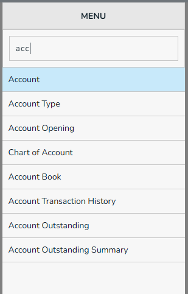
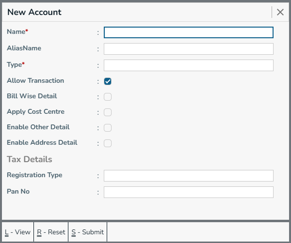
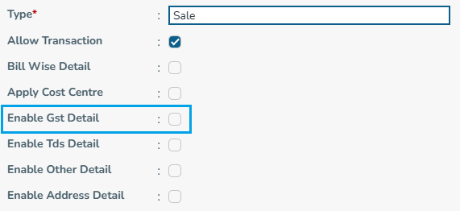
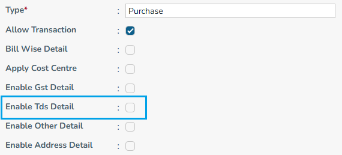
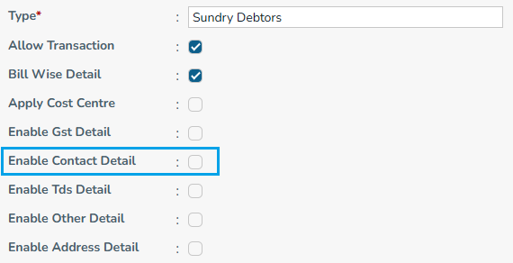
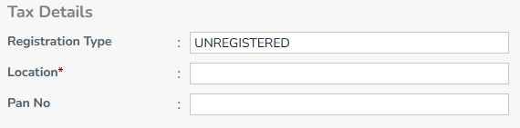
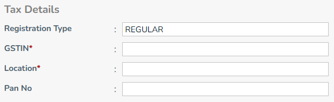
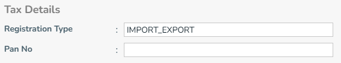
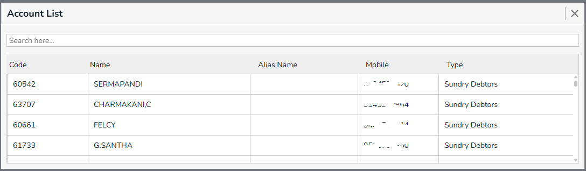

## Select Account From Menu

type `acc` in menu box, it lists menus that are startswith `acc`. press down arrow and select `Account`.

## New Account

Required Fields,
  * Name - Account name
  * Type - Account type, ex: Sundry Creditor / Sundry Deptor / ..

Optional Fields,
  * Alias Name - Alias name for account.

- `Enable Gst Detail` will be visible for account type [ EFT_ACCOUNT, DIRECT_EXPENSE, 
INDIRECT_EXPENSE,FIXED_ASSET,DIRECT_INCOME,INDIRECT_INCOME,SALE,
PURCHASE,DUTIES_AND_TAXES,SUNDRY_CREDITOR,SUNDRY_DEBTOR ]

- `Enable Tds Detail` will be visible for account type [ DIRECT_EXPENSE, INDIRECT_EXPENSE,
  DIRECT_INCOME, INDIRECT_INCOME, SALE, PURCHASE, SUNDRY_CREDITOR, SUNDRY_DEBTOR ]

- `Enable Contact Detail` will be visible for account type [ SUNDRY_CREDITOR, SUNDRY_DEBTOR ]

- `Location` in Tax Details will be visible for registration type ["REGULAR","COMPOSITE","SPECIAL_ECONOMIC_ZONE","UNREGISTERED"]

- `GSTIN` in Tax Details will be visible for registration type ["REGULAR","COMPOSITE","SPECIAL_ECONOMIC_ZONE"]

- `GSTIN` & `Location` in Tax Details will not be visible for registration type ["IMPORT_EXPORT"]

- Refer: [Default Account Types Details](../account-type#default-account-types-details)

## Account List

## Edit Account

{/*  */}

