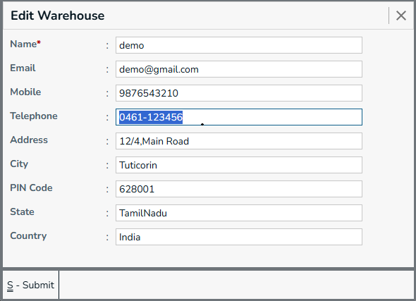

A Warehouse is a physical location used to store and manage the company's inventory or products. It helps the system identify where stock is kept and allows inventory transactions to be associated with the appropriate storage location.

A company can have multiple warehouses, such as a main warehouse, branch warehouse, distribution center, or any other location where products are stored.

## New Warehouse

Menu -> `Warehouse`

Use the New Warehouse form to create a warehouse by entering its basic information and location details.
   

Required Fields
  * Name - Name of the warehouse.

Optional Fields
  * Email - Email address associated with the warehouse.
  * Mobile - Mobile number associated with the warehouse.
  * Telephone - Telephone number of the warehouse.
  * Address - Complete address of the warehouse.
  * City - City where the warehouse is located.
  * Pincode - Postal code of the warehouse location.
  * State - State where the warehouse is located. [State Search box](../../prerequisite#state-search-box)
  * Country - Country where the warehouse is located. [Country Search box](../../prerequisite#country-search-box)

## Warehouse List

The Warehouse List displays all warehouses available in the system. Users can search and select a warehouse from the list to view or edit its details.
 

**Actions**
* **Submit** - Press `Ctrl+S` or Click on `Submit` button, this form will be submitted to server and new `Gst Registration` will be saved in server. and a green color `success` toast will be showed.
* **Reset** - Press `Ctrl+R` or Click on `Reset` button, the filled form will be resetted, and you can enter new details.
* **View** - Press `Ctrl+L` or Click on `View` button, you will be navigated to `Gst Registraion List` page.
* **Go To Back** - Press `Esc` or Click on `X` (Forms top right corner), you will be navigated to the previous page. and the `Menu` page will be showed.

## Edit Warehouse

The Edit Warehouse form allows users to modify the details of an existing warehouse. You can update the warehouse name, contact information, or location details and save the changes.

 
