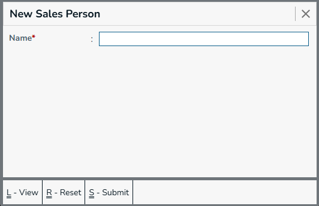
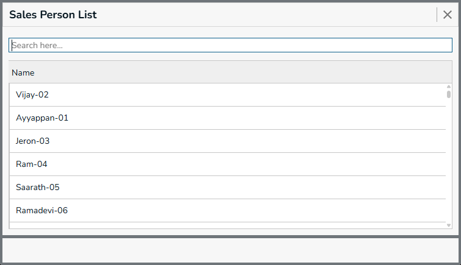
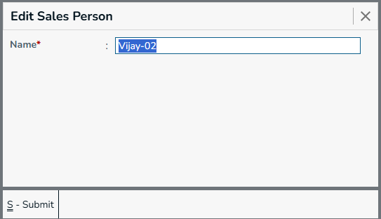

A Sales Person is an employee or representative responsible for handling sales activities and selling products to customers. Sales persons can be associated with sales transactions to identify who handled or generated a particular sale.

This information helps the business track sales performance and identify the sales person responsible for each transaction.

## New Sales Person

Menu -> `Sales Person`

 

Use the New Sales Person form to create a sales person by entering their basic details.  

Required Fields
  * Name - Name of the sales person.

## Sales Person List

 

The Sales Person List displays all sales persons available in the system. Users can search and select a sales person to view or edit their details.

**Actions**
* **Submit** - Press `Ctrl+S` or Click on `Submit` button, this form will be submitted to server and new `Gst Registration` will be saved in server. and a green color `success` toast will be showed.
* **Reset** - Press `Ctrl+R` or Click on `Reset` button, the filled form will be resetted, and you can enter new details.
* **View** - Press `Ctrl+L` or Click on `View` button, you will be navigated to `Gst Registraion List` page.
* **Go To Back** - Press `Esc` or Click on `X` (Forms top right corner), you will be navigated to the previous page. and the `Menu` page will be showed.

## Edit Sales Person

 

The Edit Sales Person form allows users to modify the details of an existing sales person.

## Export Sales Person

The Export Sales Person option allows users to export the available sales person records for external use or further processing. 

## Sample Excel File

[Sample Sales Person Excel](./sales-person.xlsx) 