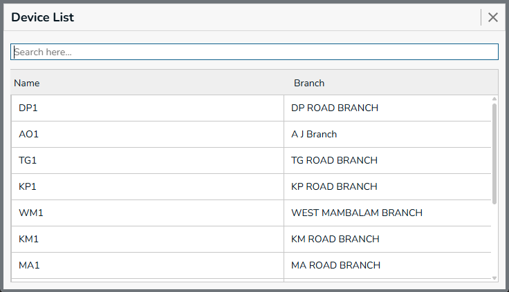
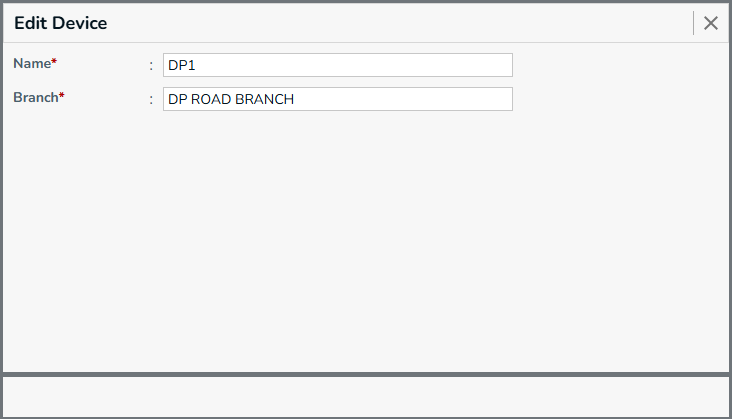
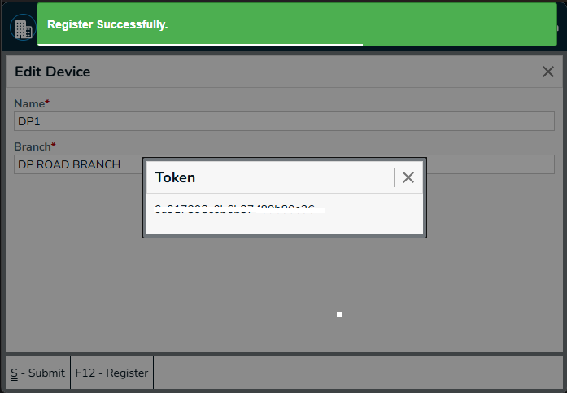
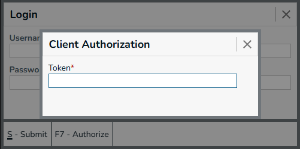

## New Device

A Device represents a physical device used by the business to perform operations through the system. Each device can be registered and associated with a specific branch, 
allowing the system to identify which device belongs to which business location.

Device registration helps the system manage and identify the devices that are authorized to connect and operate within the application.

Menu -> `Device`

 

Use the New Device form to create a device and associate it with the appropriate branch.

Required Fields
  * Name - Name used to identify the device.
  * Branch - Branch to which the device belongs. [Branch Search box](../../prerequisite#branch-search-box)

## Device List

 

The Device List displays all devices created in the system. Users can view the available devices and select a device to edit its details.

**Actions**
* **Submit** - Press `Ctrl+S` or Click on `Submit` button, this form will be submitted to server and new `Gst Registration` will be saved in server. and a green color `success` toast will be showed.
* **Reset** - Press `Ctrl+R` or Click on `Reset` button, the filled form will be resetted, and you can enter new details.
* **View** - Press `Ctrl+L` or Click on `View` button, you will be navigated to `Gst Registraion List` page.
* **Go To Back** - Press `Esc` or Click on `X` (Forms top right corner), you will be navigated to the previous page. and the `Menu` page will be showed.

## Edit Device

 

The Edit Device form allows users to modify the details of an existing device, including its name and associated branch.

## Register Device

The Register Device option is used to register a device with the system so that it can be identified and authorized for use. This connects the physical device with its corresponding device record in the application.

 

* Admin only have the access to register the device.
* Press F12 for register the device to get the token.
* Member collect the token from admin.
* Next Go to the Login Screen - [Login Screen](../../intro.mdx-auditplus-login-screen)
* Press F7 to open the Client Autorization dialog.
* Paste the token in the token field, the system will be registered.

