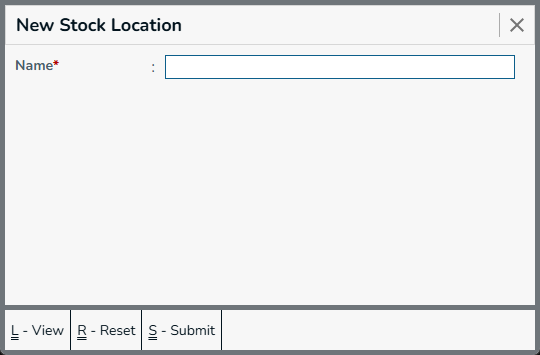
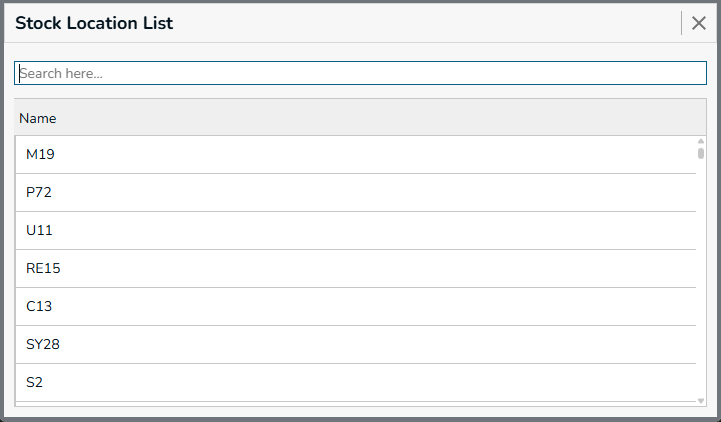

A Stock Location is used to identify the specific place where products or inventory are stored within the business. It helps organize stock into different locations, sections, racks, or other designated storage areas, making it easier to track where a particular product is kept.

For example, a warehouse can have multiple stock locations such as Rack A, Rack B, Cold Storage, or Medicine Section. This allows the system to maintain more detailed information about the physical location of inventory.

## New Stock Location

Menu -> `Stock Location`

  

Use the New Stock Location form to create a location where stock can be stored or managed.

Required Fields
  * Name - Name used to identify the stock location.

## Stock Location List

The Stock Location List displays all stock locations available in the system. Users can search and select a stock location to view or edit its details.

**Actions**
* **Submit** - Press `Ctrl+S` or Click on `Submit` button, this form will be submitted to server and new `Gst Registration` will be saved in server. and a green color `success` toast will be showed.
* **Reset** - Press `Ctrl+R` or Click on `Reset` button, the filled form will be resetted, and you can enter new details.
* **View** - Press `Ctrl+L` or Click on `View` button, you will be navigated to `Gst Registraion List` page.
* **Go To Back** - Press `Esc` or Click on `X` (Forms top right corner), you will be navigated to the previous page. and the `Menu` page will be showed.

## Edit Stock Location

The Edit Stock Location form allows users to modify the name or other available details of an existing stock location.