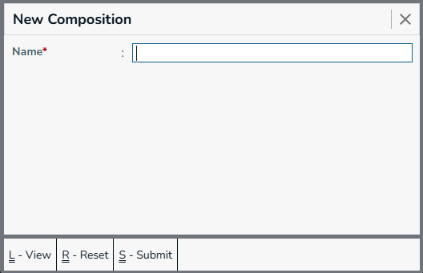

Composition is used to define the active ingredients or chemical substances present in a medicine or product. It helps identify the ingredients and their respective strengths, making it easier to recognize products that contain the same or similar active ingredients even when their brand names are different.

For example, different medicines may be sold under different brand names but contain the same main active ingredient. The Composition master allows these ingredients to be maintained separately and associated with the appropriate products.

## New Composition

Menu -> `Composition`

  

Required Fields
  * Name - Composition name

Optional Fields

The Medical extension is used in a application then the drug Classification field shows.
  * Drug Classification - [Drug Classification](../drug-classification/index.mdx)

## Composition List

 

* Press Ctrl + L to view the list.

Examples of compositions maintained in the system include:

 * Bioperine 5 MG
 * Commiphora Myrrha 50 MG
 * Palmitoylethanolamide 200 MG
 * Potassium-Magnesium Citrate 978 MG
 * Terbutaline 1.25 MG
 * L-Carnitine 20%

These compositions can later be associated with products to indicate the chemical or active ingredients contained in the product.

## Edit Composition

Select the composition from the list to edit the composition.

 

After edit the selected composition press Ctrl + S to submit the changes.